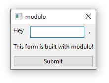

# modulo

##### Currently work-in-progress, still not ready for use

> A (very) basic Cross-platform GUI Toolkit for Any Language

Modulo is a simple, distributable binary that can be used to generate a variety of native GUI dialogs with ease:

TODO: add cross-platform screenshot

### How it works

There are a variety of built-in dialogs that can be customized by feeding modulo with YAML (or JSON) descriptors:

1. Create a `form.yml` file with the following content:

```yaml
layout: |
  Hey {{name}},
  This form is built with modulo!
```

2. Invoke `modulo` with the command:

```
modulo form -i form.yml
```

3. The dialog will appear:



4. After clicking on `Submit` (or pressing CTRL+Enter), modulo will return to the `STDOUT` the values as JSON:

```json
{"name":"John"}
```

This was a very simple example to get you started, but its only the tip of the iceberg!

### Technology

Modulo is written in Rust and uses the [wxWidgets](https://www.wxwidgets.org/) GUI toolkit under the hoods. This allows modulo to use platform-specific controls that feel, look and behave much better than other solutions based on emulation (such as web-based technologies as Electron), with the additional benefit of a very small final size.

More info coming soon...